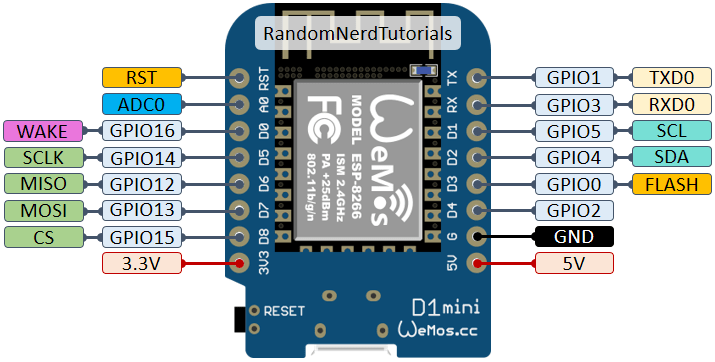

[](https://github.com/luisrmendes/rush/actions/workflows/checkAndRelease.yml)

# Rush

My monolithic project to control everything in my house.  
Handles Telegram bot chat API and climate data through ESP8266 sensors. Controls desktops (monitor and keyboard brightness according to ambient brightness, desktop wakeup), telegram chat commands and electric outlet control with RaspberryPi and Energienie sockets.
Using GitHub actions for automatic deploy.

## Setup

Setup Rust  
```curl --proto '=https' --tlsv1.2 -sSf https://sh.rustup.rs | sh```

Build  
```cargo build```

Setup as a systemd service
```cd scripts && sudo ./setup_system_service.py```

## Telegram Bot commands and description  

ipv4 - Get ipv4 home address  
wakeup_snowdog - Wake up desktop WoL  
status_snowdog - Check if Snowdog is online  
disable_brightness_auto_control - Disable automatic brightness control  
enable_brightness_auto_control - Enable automatic brightness control  

## ESP8266 PIN layout

```c
#define LED_1_PIN 2
#define LED_2_PIN 0
#define LED_3_PIN 4
#define LED_4_PIN 5
```



## How To Run Locally

```sh
cd src/main/  
go run main.go 
```

## Host Machine Dependencies

- dnsutils (dig...)
- wol  
- Requires desktop i2c monitor bus numbers  
- gnu-netcat
- Currently using .ssh/config file

## Desktop Brightness Control Dependencies  

- ddcutil  
- i2c-tools  
- User monitorControl in i2c group  
- User monitor in video group
- Add udev rule to give video group brightness control permissions
- Add monitorcontrol write permissions to kbd_backlight (eg on .bashrc, "sudo chmod 757 /sys/class/leds/tpacpi\:\:kbd_backlight/brightness")

## Set OLLAMA access

OLLAMA_HOST=0.0.0.0:8080

## TODO

## Ollama create a llm with a modelfile

```
ollama create ambrosio -f ./AmbrosioModelfile
```

Remove all dependencies like ddcutil i2c-dev i2c-tools
How to setup ollama: <https://www.youtube.com/watch?v=QSfvLWaJc2s>

## Install Whisper

Use whisper:  
whisper AwACAgQAAxkBAAIaGWcuMfNBy9Y1UYrtoCmYw4fPy8R4AAJKGQACJIFwUY0kcMq9LnTdNgQ.ogg  --model turbo

## Shelly connections
